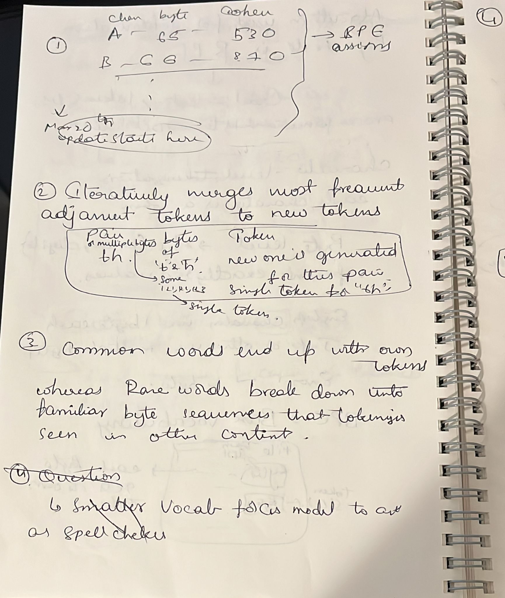
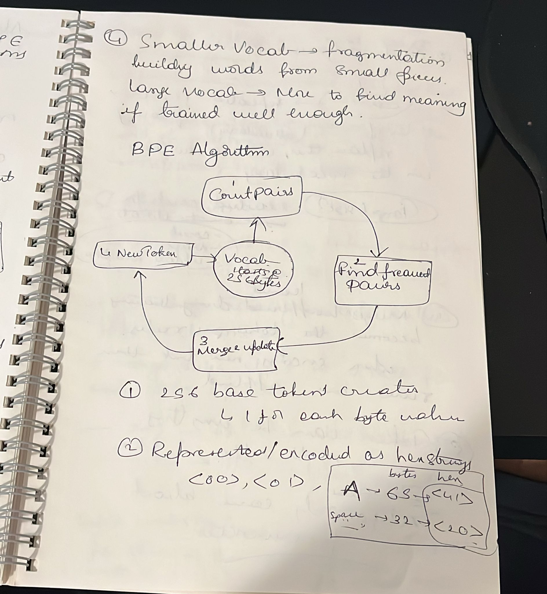
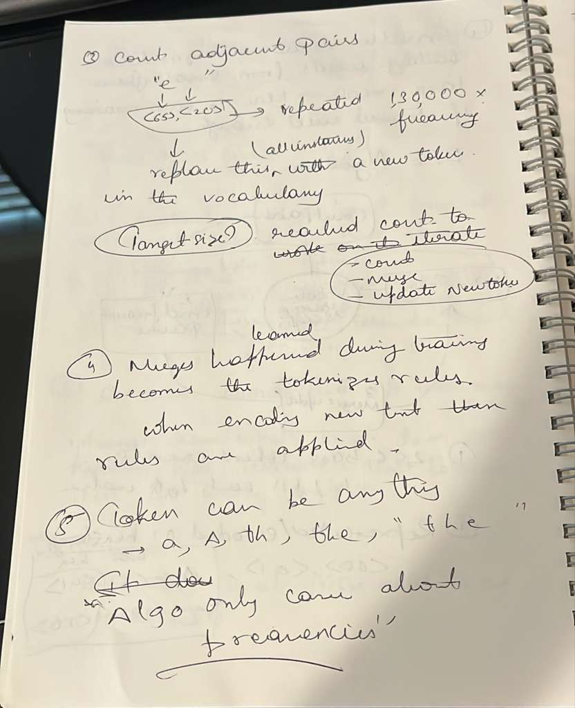

Learnings so far from the [Building LLM from scratch using Rust](https://www.tag1.com/how-to/part1-tokenization-building-an-llm-from-scratch-in-rust/)

Tokenization, building an LLM from scratch using Rust.

Part 1:
3 things:

1. Converting Text to numbers using Byte Pair Encoding (BPE)
2. How this step shapes everything the model can and cannot do.
3. How different vocabulary sizes effect compression, speed and training behaviour.

Questions that popped up during the study:

1. Tokenizer? -> Tool used to convert text to numbers
2. BPE? Algorithms used in the tokenization process
3. Feste? -> The LLM name that we are building
4. Transformer? -> Deep learning architecture
5. Shakesphere? -> Real one? or any name for a tech/software? -> The Real one! and this model is trained on Shakesphere complete works.

## Learning about Transformer

### Question: What exactly is a transformer and difference between transformer and a language model?

### Transformer is a deep learning architecture used in the language model. It basically has encoding-decoding structure and works on the "Attention Mechanism"

## What is attention mechanism?

### This method finds the relation between multiple words and how are they related with each other in a sentence.

## Difference between transformer and a conventional NN: This Transformer is found as a replacement for RNN/CNN. The conventional neural networks process data sequentially which takes a lot of time and storage space where as Transformer model can process large amount of data points parallelly like finding relevance, encoding, decoding etc.

## More about the transformer model:

### Transformer model holds a large amount of context. Transformer model does paralelly processes parameters like grammar, emotion etc. It has multi-head self attention for finding and understanding relationship between words. It also does positional encoding to maintain the order of words in a sentence.

### Example: Ramu goes to temple in his village. In this sentence the word "his" refers to the person name "Ramu". This is identified by the model using the self attention mechanism.

## Applications:

### Training a customer support chatbot, medical report summaries etc

## Benefits:

### 1. Long range context

### 2. Concurrency/Parallelism

### 3. Scalability

##Resources: [About Transformers](https://youtu.be/lopXj1p6Ewk?si=XnRMJLDPw4PwhJrm)

##What are we building?

### 'Feste' -> A GPT 2 Style Architecture model built in complete Rust as in general using Tensorflow/PyTorch for building transofrmer model abstracts away (eliminates or gives a theoretical level idea) math so that we can focus on the architecture. But in Rust it includes low-level memory management, performance, borrow checker on ownership and memory (control over all these things) safety.

#Why Tokenization matter?

##Considering the following example:

["he", "llo"] -> say "he" represents tokenID 530 and "llo" tokenID 840 respectively

[" he","llo "] -> say " he" represents tokenID 460 and "llo " tokenID 670 respectively

["ol", "leh"] -> say "ol" represents tokenID 91 and "leh" represents tokenID 133 respectively

Though the memory contains the word "hello", it can't reverse the string because of different tokenIDs in each scenario resulting in a mismatch. This is one of the reasons a simple LLM stuggles to perform operations on a string like reversing it. At word level tokenization is not efficient.

# Algorithm used for Tokenization by Feste is BPE

## The goal is to convert Text to TokenIDs -> process neural networks -> convert those tokenIDs back to text and generate the output.

## Instead of using tokenization at the word level we would go to character level where each character is a token.

## Byte level -> 8bit (binary digits) represent exactly 256 values.

## English characters use 1 byte each while others use multiple bytes. For example emojis use 4bytes.

## Each byte gets it's own tokenID in the file

#Implementation Details:

## Starting with 256 entries mapping hex-encoded bytes to IDs (0-255)

## During training -> add entries for each merge

## Merge rules stored in a vector for order significance

#Example

## Before encoding "the" -> should apply merge1(M1) first for token256 then apply merge50 (M50)

## M1 -> "th" <74><68> token 256 ...... M50 ->"the" => token 256+<65> = token 300

## Training process is completely deterministic like count pairs, find frequently occurring pairs, merge them, repeat. This ensures in no randomness.

# Training Performance

## Bottleneck: Counting adjacent pairs in the corpus

## Instead of single threaded implementation, using Rayon(Rust library) for parallel counting where chunks (chunk1,chunk2...etc) are divided and counted in parallel.

## Each thread checks its chunk boundary and count pair between last token and next chunk's first token such that no pairs are missed.

## Sequential: Apply merge rules and updating corpus

## Parallelism: Chunk boundary checks so that no pair is missed.
